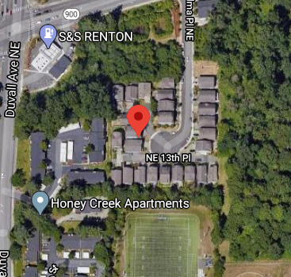

```{r setup, include=FALSE}
knitr::opts_chunk$set(echo = TRUE)
```


## Dane

Dane dotyczą cen nieruchomości w hrabstwie King w stanie Washington. Wybrałem ten temat, gdyż ten temat jest mi poniekąd bliski --- chcąc nie chcąc oglądałem często programy typu ,,Property brothers'', więc też dowiedziałem się nieco o samym temacie. 


Mamy do dyspozycji:

* cenę nieruchomości (`price`),
* l. sypialni (`bedrooms`),
* l. łazienek (`bathrooms`),
* powierzchnia użytkowa (`sqft_living`),
* powierzchnia gruntu (`sqft_lot`),
* liczba pięter (`floors`),
* czy nad wodą (`waterfront`),
* jakość widoku (`view`),
* w jakim stanie jest apartament (`condition`),
* jakość konstrukcji i wykończenia: im wyższa, tym lepsza (`grade`),
* powierzchnia pięter / piwnicy (`sqft_above`,`sqft_basement`),
* rok budowy (`yr_built`),
* rok remontu (`yr_renovated`); `0` w przypadku braku),
* kod pocztowy,
* współrzędne geograficzne (`lat`,`long`),
* średnia powierzchnia użytkowa/gruntu dla 15-Nearest Neighbors (`sqft_living15`,`sqft_lot15`).

Mamy również zmienną `id`. W pierwszej kolejności może się to wydawać nieistotne, ponieważ zmienna ta zostanie potraktowana przez model jako `int`; teoretycznie należałoby ją od razu wykluczyć, albo zamienić na `category`. Okazuje się jednak, że jest 175 nieruchomości, które były sprzedane 2 razy w ciągu tego roku, a jedna aż 3. Studium przypadku domu (`id==795000620`) -- ten miał 3 sprzedaże -- i tych sprzedanych dwukrotnie pokazuje, że dany dom może być sprzedany (bez remontu) za różne kwoty. Należałoby je pominąć --- nie jest ich dużo, a wyjaśnialność takich przypadków jest niewielka. Wpływ na ich cenę ma tu raczej zewnętrzne czynniki takie jak charyzma sprzedającego. Stosowny kod do samodzielnego uruchomienia:

```{r duplicates,eval = FALSE}
data <- read.csv("kc_house_data.csv")
idiki <- table(data$id)
print(length(idiki[idiki==2]))  # 175

View(data[data$id == idiki[idiki==3],])
idiki_dup <- unique(as.numeric(names(idiki[idiki>1])))
duplicates <- ((data[data$id %in% idiki_dup,]))
View(duplicates)

```

Zapisujemy więc kopię `csv`ki bez nich, dalej będziemy pracować na niej.
Dodamy jeszcze zmienną `since_update`, która będzie liczbą lat od ostatniego remontu
```
bez_dup <- data[!data$id %in% idiki_dup,]
write.csv(bez_dup,"kc_house_data_unique.csv")
```
## Wstępnie przetwarzanie

Wczytujemy i przygotowujemy dane. 
```{r first, eval=TRUE}
library("dplyr")
df <- read.csv("./kc_house_data_unique.csv")

df$since_update = 2020 - pmax(df$yr_built,df$yr_renovated) #czas od remontu/budowy
df <- df %>% select(-c(id,date))   # pozbywamy się id i daty

N <- nrow(df)
X <- df %>% select(-price)

#podział próbki na uczącą/testową, prop=0.7
s <- sample(N)
k <- round(0.7*N)  
s_train <- s[1:k]
s_test <- s[-c(1:k)]
df_train <- df[s_train,]
df_test <- df[s_test,]

```


## Budowa modelu

Budujemy model. Tutaj, dla przyspieszenia obliczeń, posłużymy się modelem zbudowanym już wcześniej.
```{r loading}
library("randomForest")
# rf <- randomForest::tuneRF(X_train,y_train,doBest=TRUE)
tuned <- readRDS("rf_tuned.rds")  # model zbudowany j.w.

y_pred <- predict(tuned,newdata=df_test)
y_test <- df_test$price
mean(abs((y_pred - y_test)/y_test))
```

Model jest całkiem dobrze dopasowany. Średni błąd względny to 7\%, co może być spowodowane dużą zmiennością na rynku. Rynek amerykański jest nieco inny niż polski. W Polsce, jeśli mieszkanie jest ileś warte, to sprzedając czekamy, aż ktoś będzie gotowy tyle zapłacić. Choćby to miało trwać i dwa lata. W Ameryce jest nieco inaczej. Tam jeśli dom nie sprzeda w ciągu ok miesiąca, to jest poważny sygnał, aby obniżyć cenę. Brakuje więc zmiennej opisującej czas ekspozycji. Ponadto, jeśli komuś bardzo zależy na czasie w ameryce, to zaniży cenę mieszkania. 

Są również warunki kupna mieszkania. Np. oferta kupna ma dodatkowe warunki, np. inspekcja budowlana. Albo, że kupujący nie kupi mieszkania X, jeśli nie sprzedał swojego mieszkania. Jak wiadomo, w Polsce jest nieco inne podejście do kupna nieruchomości. To też może tłumaczyć dużą zmienność, której nie da się objaśnić tymi danymi. 

Dalej, w ameryce ważna jest też dzielnica. Dlaczego? Szkoły. Poziom szkół jest różny. Jedne są lepsze, inne gorsze. Jest jednak tak, że uczniowie mieszkający w dzielnicy $i$-tej, są przypisane do szkoły $s_i$. Dlatego domy ulicę dalej mogą kosztować zupełnie inaczej, przy tych samych parametrach. Z jednej strony jest to opisane przez zmienne `lat`,`long` i częściowo przez `zipcode`, ale warto byłoby się również bliżej temu przyjrzeć. Być może również postarać się o dodatkowe dane opisujące to. 


## Wyjaśnialność

Spróbujemy wytłumaczyć model na podstawie obserwacji nr 6. Wybrałem tą obserwację, ponieważ znajdowała się w `head(df)` i była bardzo droga. Ciekawe, co to za cacko…
```{r mansion}
library("iBreakDown")
mansion <- df[6,]
mansion_pred <- predict(tuned,newdata = mansion)
bd_rf <- break_down(tuned, new_observation = mansion, data=df_train)
print(mansion$price) # true value
print(mansion_pred)  # predicted
print(mansion_pred / mansion$price)  # relative
plot(bd_rf)
```

Widzimy więc, że zawrotna cena posiadłości jest spowodowana:

* jej jakością, designem,
* ogromną powierzchnią (ponad 500m²),
* bogatą dzielnicą.

Dom traci jednak przez odległość od rzeki (`long`).

Po współrzędnych geograficznych można znaleźć posiadłość na mapie Google. Oczywiście tylko w przybliżeniu, ponieważ mamy dość niewiele miejsc po przecinku tych współrzędnych. Nie mniej jednak, podmieniając ostatnie cyfry w tych rozwinięciach, można stwierdzić na jakim osiedlu znajdowała się ta posiadłość.



     
Jest to więc ciche, spokojne, burżuazyjne osiedle, spokojne (nawet Google Street View nie chciał przeszkadzać), niedaleko parku narodowego, otoczone zielenią, a zarazem dość blisko cywilizacji, szkoły, siłowni itp.


## Podsumowanie

Widzimy, że model  daje się bardzo dobrze wytłumaczyć oraz daje dobre predykcje. 

