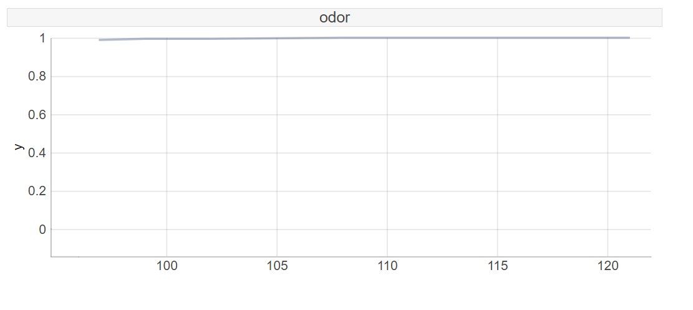

# Homework 4
Kazimierz Wojciechowski
16.04.2020

---

## Task 4
> Find two observations in the data set, such that they have different CP profiles (e.g. model response is growing with age for one observations and lowering with age for another). Note that you need to have model with interactions to have such differences

- For gill size (narrow/broad) there appears to be a slight interaction:
  
  
  For most instances narrow gill indicates edibility but for some the relation is minimally opposite.

- Usually spore print color is easily divided: buff and chocolate colours indicate edibility, while others make are usually an indicator of toxicity:
  
  The buff colour is a mix of beige, yellow and orange. Chanterelle mushroom is a perfect an example of an edible fungus having this spore colour: 
  
  With a slightly less saturated colour, the morel mushroom is also a great example:
  

  Interestingly, sometimes the mushroom is predicted to be edible regardless of its colour:
  
  Other times there appears to be a mild interaction:  
  

  

- Habitat is also an example of a variable where varying interactions are mildly visible:
  
  
  The slightly elevated curve is evident for mushrooms found near paths, in urban or in waste areas, which seems counterintuitive. Other areas include grass, leaves, meadows and woods. On the other hand the raised chances are not as overpowering.  
  Random forests tend to skew towards the mean, perhaps the unintuitive are underrepresented. Below 112 represents the paths class, 117 and 119 represent urban and waste classes respectively.

  

- For the odor variable there appears to be no interactions:
  
  
  

---

## Task 5

> Train a second model (of any class, neural nets, linear, other boosting) and find an observation for which CP profiles are different between the models

I decided to compare a random forest to a multilayer perceptron.

The largest variations in Ceteris Paribus decompositions were observed for the following features:
- Spore print colour differences:

  Random forest:
  
  Neural network:
  

  Random forest:
  
  Neural network:
  

  Random forest:
  
  Neural network:
  

- Odour decomposition differences:

  Random forest:
  
  Neural network:
  

  Random forest:
  
  Neural network:
  

  Random forest:
  
  The random forest persistently predicts that mushrooms with almond, musty or lacking an odor indicate edibility. Whereas pungent, spicy, fishy, creosote and foul odors indicate toxicity.

  Neural network:
  

  Although the multilayer perceptron has high AUC accuracy its ceteris paribus graphs for spore colour and odour reveal that the neural network brutally linearizes categorical variables. Whereas the random forest shows much more plausible non-monotonic behaviour. In this case we should mistrust the neural network.

- It appears that in the mushroom dataset there are mild interactions. Interestingly, they are evident in variables that contribute most to the predictions:
    - odour
    - spore print colour
    - gill size

  It is important to point out that these results agree with the experience gathered from previous homeworks: the mentioned variables were most frequently responsible for explaining the predictions.

---

## Task 6

> Comment on the results for points (4) and (5).

Comments added above.