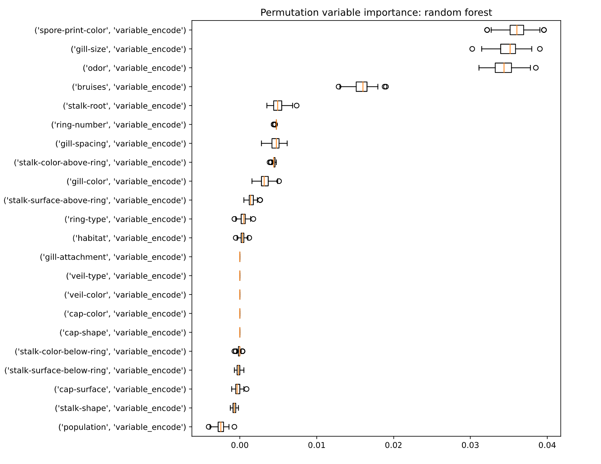
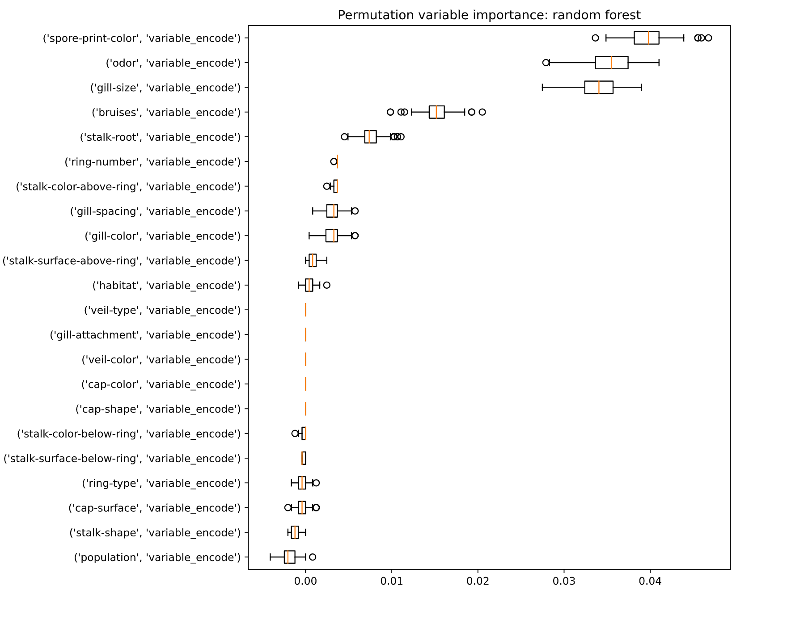
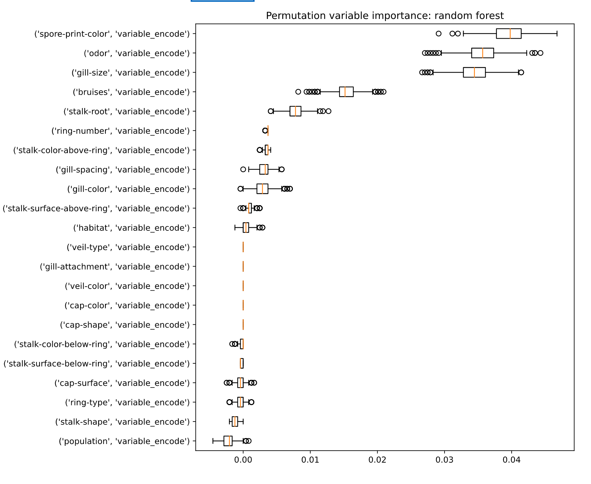
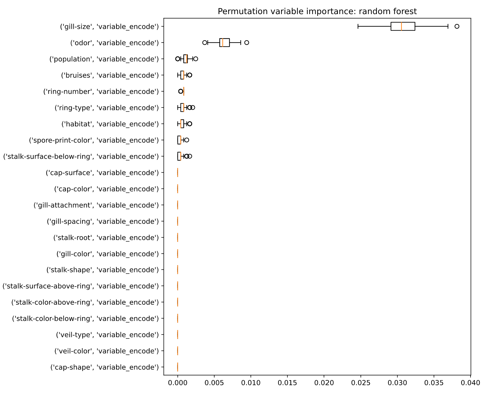
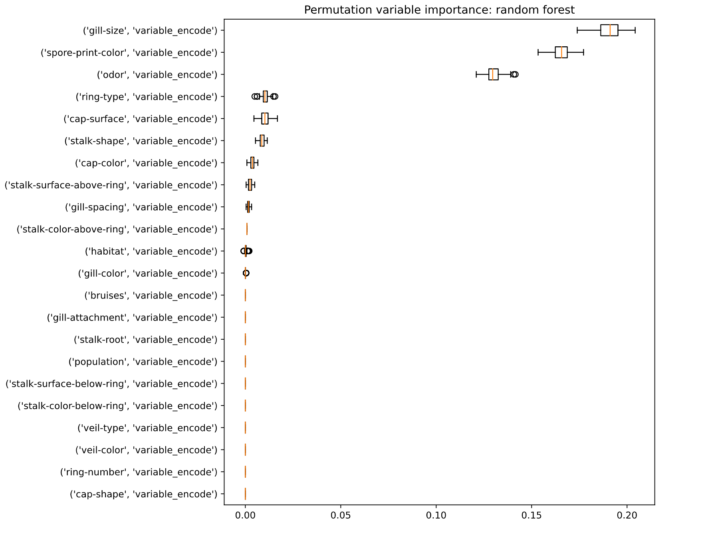

# Fifth homework

### 04.05.2020
### Kazimierz Wojciechowski
### [Kaggle mushroom edibility dataset](https://www.kaggle.com/uciml/mushroom-classification)

## 1. For the selected data set, train at least one tree-based ensemble model (random forest, gbm, catboost or any other boosting)

## 2. Calculate permutational variable importance for the selected model

The following are results for a random forest model:

* 9 estimators, max depth: 3, train set, 100 iterations

  * It appears that for a random forest model with 99% AUC accuracy the most important variables are colors of spore prints, gill sizes and odors of mushrooms. Bruises also play a role in predicting edibility, but it is not as significant. The results above appear consistent with instance-specific findings from previously considered XAI techniques (gill size and odor were overwhelmingly important in these cases).

## 3. Train three or more candidate models (different variables, different transformations, different model structures) and compare ranking of important features between these models. Are they similar or different?

* 9 estimators, max depth: 3, test set, 100 iterations

  * Our findings in the case of the test set are consistent with the findings from the training set. Predictions heavily rely on 3 main features accompanied the existence of bruises feature.

* 9 estimators, max depth: 3, test set, 1000 iterations

  * The permutation variable importance is quite stable, after 100 iterations we achieve results strikingly similar to as if we have run 10 times more feature permutations. 

* 20 estimators, max depth: 10, test set, 1000 iterations

  * Interestingly, after developing an overfitting model we found that prediction is fuelled by basically only one feature: gill size. Contrary to previous findings, odor plays a marginal role in predicting mushroom edibility.
  * Heavy reliance on one feature intuitively indicates overfitting and indeed, it is the case. Even though AUC score is 100% we should distrust the model since *A particular shape or colour is not going to clearly indicate whether or not a mushroom is edible or poisonous – these are guidelines to be considered together and alongside secondary sources. [[lovethegarden.com]](https://www.lovethegarden.com/uk-en/article/poisonous-and-edible-mushrooms)*. It clearly evident that this model does not even remotely reflect reality.

* 4 estimators, max depth: 3, test set, 100 iterations

  * Finally we trained a model with smaller degrees of freedom achieving performance on the order of 99%. Although the results differ from the standard (9) number of trees: the most important variables have different order, it does take into account the very same 3 variables. The X axis is half as long compared to previous chart, which indicates that the model is especially sensitive to individual features (FI^j = e^perm / e^orig [[*Interpretable Machine Learning*, Christopher Molnar](https://christophm.github.io/interpretable-ml-book/feature-importance.html)], if e^perm vastly differs from e^orig, the feature importance drops closer to 0).

## 4. Comment on the results for points (2) and (3)

